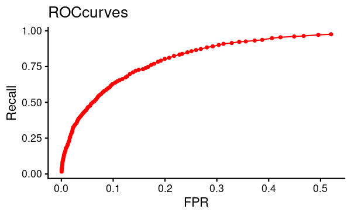
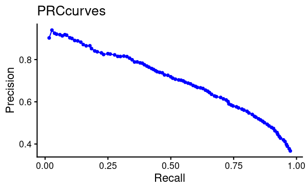

# m6APrediction: An R Package for m6A Methylation Site Prediction

## Tool Introduction and Purpose
`m6APrediction` is an R package designed specifically for bioinformatics researchers. It aims to accurately predict m6A methylation sites in RNA sequences using machine learning models, facilitating the exploration and analysis of m6A modification mechanisms in epitranscriptomic research.

## Installation Method
You can install this package from GitHub using the `devtools` or `remotes` package:

```r
# Install devtools (if not installed)
install.packages("devtools")
devtools::install_github("YourGitHubUserName/m6APrediction")

# Or use the remotes package
install.packages("remotes")
remotes::install_github("YourGitHubUserName/m6APrediction")
```

## Model Performance Demonstration

### ROC Curve


### PRC Curve



